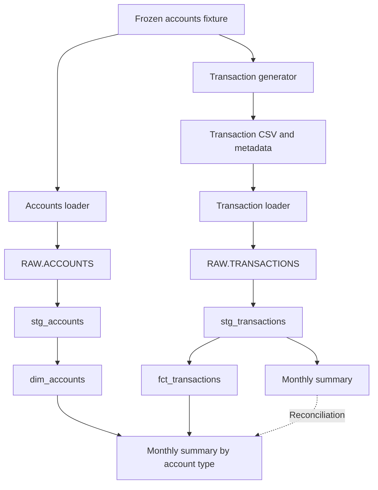

# Synthetic Banking Analytics with Snowflake and dbt

A reproducible learning and portfolio project that generates synthetic payment
and refund data, validates and loads it into Snowflake, and uses dbt to build
account and transaction models with reconciled monthly reporting.

**Business questions:** How much completed net outflow occurred each month?
How does it differ by account type and active-account count? Which accounts
have no completed transactions?

Start with [fresh-clone setup](docs/fresh-clone-banking.md) or explore the
[saved analyses and findings](docs/banking-analysis-findings.md).
The repository retains its original `etl-nlp-project` name; NLP is not implemented.

## Active pipeline

1. A version-controlled synthetic accounts fixture supplies 2,000 accounts.
2. Python generates 10,000 deterministic payment/refund attempts as a local CSV.
3. Separate Python loaders validate inputs and load two Snowflake raw tables.
4. dbt creates two staging views, an account dimension, a transaction fact and
   two monthly summary views.
5. dbt tests validate keys, relationships, business rules and reconciliation.
   Saved analysis queries explore the resulting models.



Docker and Postgres are part of the separate legacy example, not this flow.
dbt runs locally through `uv` and sends SQL to Snowflake; it does not upload CSVs.

## Models and grain

Grain means what one row represents. All six active dbt models are **views**.

| Model | Grain | Responsibility |
| --- | --- | --- |
| `stg_accounts` | One frozen account | Explicit types, UTC opening timestamp/date; excludes synthetic balance |
| `stg_transactions` | One transaction attempt | Types all ten fields; normalises blank parent IDs; retains all statuses |
| `dim_accounts` | One frozen account | Descriptive account attributes, including accounts without transactions |
| `fct_transactions` | One transaction attempt | Preserves amounts, dates, status and account/refund references |
| `monthly_transaction_summary` | Month and currency | Completed counts, debits, credits and net outflow |
| `monthly_transaction_summary_by_account_type` | Month, currency and account type | Same measures split by the account snapshot's type |

`source()` identifies existing raw tables; `ref()` identifies dbt models and
records dependencies. The overall monthly summary reads transaction staging
directly and remains the reconciliation baseline for the account-type summary.

With target schema `DBT_AOIFE`, models are created in
`BANKING_ANALYTICS.DBT_AOIFE_STAGING` and
`BANKING_ANALYTICS.DBT_AOIFE_MARTS`. A different target schema changes those
suffix-prefixed output schemas. Raw tables remain in `BANKING_ANALYTICS.RAW`.

See [model design](docs/account-transaction-model-design.md),
[dimension/fact details](docs/account-transaction-marts.md) and
[account-type reporting](docs/monthly-account-type-summary.md).

## Reproduce locally without Snowflake

Install Git and uv, then run from a fresh clone:

```sh
git clone https://github.com/alennon2001/etl-nlp-project.git
cd etl-nlp-project
uv sync --locked
uv run python scripts/generate_transactions_v2.py
uv run python scripts/load_accounts_snowflake.py --validate-only
uv run python scripts/load_transactions_snowflake.py --validate-only
uv run python -m unittest discover -s tests -v
```

`.python-version` pins Python 3.12.13. `pyproject.toml` declares dependencies
and `uv.lock` records resolved versions. `uv sync --locked` recreates the
ignored `.venv`; `uv run` uses it without manual activation.

Generation creates ignored `output/banking-v2/transactions.csv` and
`generation.json`. It refuses to overwrite an existing output directory.
On an existing checkout, validate the current output; do not delete it just
to repeat setup. The reproduction test generates in temporary storage.

The required input is [fixtures/banking-v2/accounts.csv](fixtures/banking-v2/accounts.csv),
with its [checksum and provenance](fixtures/banking-v2/README.md).
No original customer-email file, cards file or ignored snapshot is required.
The generator uses fixed dates, a seed, stable account ordering, deterministic
UUIDs and integer-pence arithmetic.

Expected generated CSV SHA-256:

```text
119498f5d5fbc3dde9f3da8fee4e3b7e45e89ee0bd453a877d31cf62c68f0f74
```

For VS Code, select this project's `.venv/bin/python` as the interpreter.
This does not configure Snowflake authentication.

## Load and build in Snowflake

Provision your own account/user, role `BANKING_DEVELOPER`, warehouse
`BANKING_DEV_WH`, database `BANKING_ANALYTICS` and required permissions.
These objects and authentication are not provisioned by the raw-table scripts.

Configure `etl_project.outputs.snowflake_dev` in local
`~/.dbt/profiles.yml`, using your account/login, target schema and encrypted
private-key path. Register your public key with your Snowflake user.
Keep profiles, private keys and passphrases outside Git.
Detailed prerequisites are in [fresh-clone setup](docs/fresh-clone-banking.md).

Execute these files separately in a Snowflake worksheet:

1. [02_raw_transactions.sql](sql/snowflake/02_raw_transactions.sql)
2. [03_raw_accounts.sql](sql/snowflake/03_raw_accounts.sql)

Then run the initial loads interactively from the project root:

```sh
uv run python scripts/load_accounts_snowflake.py
uv run python scripts/load_transactions_snowflake.py
```

Each loader prompts privately for the encrypted key's passphrase. Inputs are
validated before connecting. Both loaders refuse populated or incompatible
tables and insert in one transaction, reconciling before commit. Accounts are
compared field-for-field; transactions are compared by row count, unique-ID
count and exact grouped counts/amounts. Failure triggers a rollback attempt.

These are initial-load tools, not recurring ingestion. Run only one loader
at a time; the empty-table check is not a concurrency lock. If commit
confirmation is lost, inspect the target before retrying.

Run the full dbt build from the project root in **zsh**:

```zsh
(
  read -rs 'DBT_ENV_SECRET_SNOWFLAKE_PRIVATE_KEY_PASSPHRASE?Private key passphrase: '
  printf '\n'
  export DBT_ENV_SECRET_SNOWFLAKE_PRIVATE_KEY_PASSPHRASE
  uv run dbt build --project-dir dbt --profiles-dir "$HOME/.dbt" \
    --target snowflake_dev
)
```

Configure dbt's `private_key_passphrase` to read that environment variable as
described in the setup guide. The loaders use their own hidden prompt instead.
The subshell limits the exported variable to this command group.

`--project-dir dbt` locates `dbt/dbt_project.yml`. Without a selection filter,
the build covers all six active models and 66 defined data tests, including
source tests. It does not invoke Python loaders. See
[accounts ingestion](docs/accounts-ingestion.md) for account-specific details.

## Validation and evidence

| Check | Purpose |
| --- | --- |
| Fixture/output hashes | Detect changed input or generated CSV bytes |
| Python validations | Validate shape, IDs, amounts, dates, categories and linked refunds |
| Python tests | Exercise reproduction, loader refusals/rollback and SQL guardrails locally |
| dbt key/category tests | Detect missing fields, duplicate keys and invalid categories |
| Relationship/date tests | Validate account references, opening dates and refund parents |
| Full-row model reconciliation | Detect missing, changed or duplicated records between models |
| Per-transaction join cardinality | Require exactly one matching dimension account |
| Monthly rollup reconciliation | Match account-type totals to the overall monthly baseline |

The current Python suite has 20 test methods; some contain multiple scenarios.
Mocked connections and SQLite guardrail tests do not establish live Snowflake
authentication or full Snowflake SQL compatibility.

Historical evidence reported during development:
- The initial two-model Snowflake build passed its 27 selected tests.
- The later staging/dimension/fact build passed its 47 selected tests.
- The developer reported a successful full-project run; its final run artifact
  is not committed here.
- The reproducibility change passed 20 local tests in the working directory
  and a temporary checkout containing only tracked/proposed files, reproducing
  the CSV byte-for-byte. That check reused the installed Python environment;
  installation on a new machine was not independently repeated.

These are historical results, not guarantees about the current warehouse.
Inspect your own `dbt/target/run_results.json` after each build.
[GitHub Actions](docs/continuous-integration.md) runs local generation,
validate-only checks and the Python test suite on pull requests and pushes to
main. It uses no Snowflake credentials and does not run the 66 database tests.
Check each run's result; workflow presence alone is not evidence of a pass.

## Metrics and example findings

Only completed attempts enter monetary summaries. Transaction count includes
both completed payments and refunds. Amounts are positive magnitudes:
payments are debits, refunds are credits, and net outflow is debits minus credits.
Refunds are assigned to their own transaction month.

Developer-supplied Snowflake results across April–September 2026:

| Measure | Result |
| --- | ---: |
| Completed transaction attempts | 9,000 |
| Debit total | GBP 2,012,092.38 |
| Credit total | GBP 226,623.07 |
| Net outflow | GBP 1,785,469.31 |
| Accounts with a completed transaction | 1,960 |
| Accounts with attempts but none completed | 13 |
| Accounts with no attempts | 27 |

Credit accounts had the highest net outflow overall and per active account
in this synthetic dataset. See [findings and definitions](docs/banking-analysis-findings.md).
The three queries in [dbt/analyses](dbt/analyses) are saved analyses using
`ref()`, not additional models created or executed by `dbt build`.

## Scope and limitations

- Data is synthetic: 2,000 accounts and 10,000 attempts, with exact designed
  status allocations. It is not evidence of real customer behaviour.
- April starts on April 21; monthly comparisons do not cover equal exposure.
- GBP is the only supported dataset currency. Grouping by currency does not
  imply that the current validations accept other currencies.
- Refund generation favours later dates by construction; this can produce
  apparent trends unrelated to real customer behaviour.
- Account types and spend-profile labels are frozen attributes. Spend profile
  is not calculated from observed transactions; attribute history is absent.
- Synthetic account balance has no ledger/as-of meaning and stays out of
  analytical models. Net outflow is not bank revenue or profit.
- Accounts and transactions are the active scope; no customer/card dimensions,
  API ingestion, S3 delivery, scheduling or NLP are implemented.
- Loaders are initial-load only, with no status updates, recurring batches,
  concurrency coordination or unattended authentication.
- A Git branch does not isolate Snowflake objects. Use distinct target schemas
  when separate database development environments are needed.

See the [dataset specification](docs/banking-v2-dataset.md) for exact rules.

## Repository guide

| Path | Purpose |
| --- | --- |
| `fixtures/banking-v2/` | Minimal immutable synthetic input and provenance |
| `scripts/generate_transactions_v2.py` | Reproducible transaction generation |
| `scripts/load_*_snowflake.py` | Validated first-load ingestion |
| `sql/snowflake/` | Raw-table definitions |
| `dbt/models/staging/` | Source declarations and standardised records |
| `dbt/models/marts/` | Dimension, fact and summaries |
| `dbt/tests/` | Custom data-quality queries |
| `dbt/analyses/` | Saved analytical queries |
| `tests/` | Local Python tests |
| `docs/` | Setup, design, dataset and analysis details |
| `archive/dbt/` | Unfinished historical models, excluded from active paths |

## Legacy examples

The original Spoof configurations in `configs/` and
`bundles/banking_bundle.json` describe customers, accounts, cards and transactions.
Rerunning them is not the supported way to reproduce the frozen v2 dataset.

`docker-compose.yml` starts Postgres 15 with persistent `pgdata` storage.
`scripts/load_csvs.py` loads the four original CSVs into Postgres using pandas
and SQLAlchemy, replacing destination tables. It does not load v2 into Snowflake.
`scripts/etl_pipeline.py` is a separate retail-cleaning example with local paths.

For legacy Postgres only, copy `.env.example` to an ignored local `.env`.
Compose reads this file, but the Python loader reads exported environment
variables. From the project root, with trusted shell-compatible values:

```sh
(
  set -a
  . ./.env
  set +a
  uv run python scripts/load_csvs.py
)
```

This replaces legacy Postgres tables and requires its original CSVs and a
running database. Changing `.env` does not change credentials already stored
in an initialized Postgres volume. None of these legacy commands is required
for the active Snowflake setup.

## Next improvements

1. Add recurring batches, safe replay and pending-to-completed status updates.
2. Strengthen per-account-type expected-result checks and load audit records.
3. Add separate database environments, then explore S3 delivery and scheduling.
